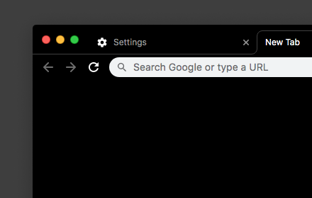

# Black #000000 Theme — White Omnibar

In this theme, everything is 100% darkest #000000 black. The omnibar is white though. This is a fork of https://github.com/Fiddle-N/material-deep-black-theme/ with white omnibar.

### Installation
Install the theme from the Chrome Web Store [here](https://chrome.google.com/webstore/detail/ojgkliamglgdfnbkncbhdklgjejagpmm/).

### Github
This theme is fully open-source under the Apache License! Check out the source code on Github at https://github.com/zyumbik/material-deep-black-theme.
